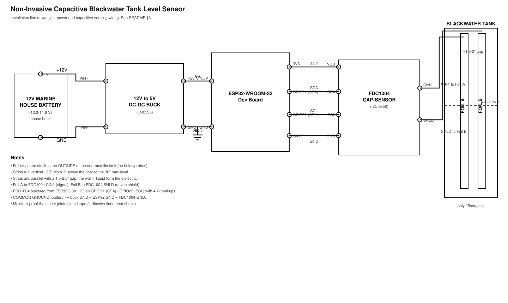

# ESP32 Non-Invasive Blackwater Tank Level Sensor (SCAD TM1 Style)

A non-contact, external capacitive liquid level monitoring system for marine/RV blackwater (sewage) holding tanks using an ESP32 micro-controller, custom foil tape sensors, ESPHome, and Home Assistant.

---

## 1. Project Overview & Operating Principle

This project implements a non-invasive, SCAD TM1-style capacitive sensor system for monitoring waste/holding tanks on boats or RVs. 

### Key Features
- **Zero Tank Penetration:** No holes, probes, or mechanical parts inside the sewage tank.
- **Solid-State Reliability:** Immune to fouling, clogging, or tissue buildup.
- **Home Assistant Native:** Integrated over Wi-Fi via ESPHome API.
- **Automated Slosh Filtering:** Integrated moving average filter to stabilize readings underway.

### How It Works
Two parallel conductive foil strips are adhered vertically to the **outside wall** of a non-metallic (polyethylene or fiberglass) holding tank. Together, the foil strips, the plastic wall, and the liquid inside form a variable capacitor:
- **Empty Tank:** Air inside the tank yields a lower dielectric constant ($\epsilon_r pprox 1$).
- **Full Tank:** Water and organic waste behind the foil yield a significantly higher dielectric constant ($\epsilon_r pprox 80$).

As liquid rises inside the tank, total electrical capacitance across the foil strips increases linearly. A **TI FDC1004** capacitance-to-digital converter (over I²C) measures this capacitance directly, giving a stable reading without requiring external Analog-to-Digital Converters (ADCs) or voltage dividers.

---

## 2. Hardware Requirements & Specifications

### Primary Components
| Component | Specification / Recommendation | Purpose |
| :--- | :--- | :--- |
| **Microcontroller** | ESP32-WROOM-32 Development Board | Runs ESPHome firmware; hosts the I²C capacitance sensor |
| **Capacitance Sensor** | TI FDC1004 (I²C, address 0x50) | Measures foil capacitance to digital: CIN1 + driven SHLD shield |
| **Power Supply** | 12V-to-5V DC-DC Buck Converter (e.g., LM2596 or marine USB module) | Steps down marine house battery bank (12V/24V) to clean 5V USB/VIN |
| **Sensor Tape** | 2-inch wide Copper Foil Tape (conductive adhesive) or HVAC Aluminum Foil Tape | External capacitive sensing electrodes |
| **Wiring** | 20–22 AWG Stranded Marine-Grade Copper Wire | Connections from foil strips to ESP32 board |
| **Heat Shrink / Seals** | Marine liquid electrical tape or adhesive-lined heat shrink | Moisture-proofing solder joints on sensor strips |

### System Specifications
- **Tank Depth:** 30 inches (76.2 cm) nominal depth.
- **Power Input:** 12V DC Marine House Battery Bank (nominal 12.0V – 14.6V range).
- **Capacitance Sensing:** TI FDC1004 over I²C (SDA=GPIO21, SCL=GPIO22, address 0x50); Foil A → CIN1, Foil B → SHLD (driven shield).
- **Grounding:** Shared common ground between the 12V system, buck converter output, ESP32 GND, and FDC1004 GND.

---

## 3. Circuit Diagram & Wiring Schematic

Installation line drawing (see [`circuit-diagram.svg`](circuit-diagram.svg)):



### ASCII Schematic

```text
                  12V MARINE HOUSE BANK (12.0V - 14.6V)
                 +-------------------------------------+
                 | (+12V)                       (GND)  |
                 +---|----------------------------|----+
                     |                            |
           +---------v----------------------------v---------+
           |     12V TO 5V DC-DC BUCK STEP-DOWN CONVERTER   |
           +---------|----------------------------|---------+
                     | (+5V)                      | (GND)
                     |                            |
              +------v----------------------------v------+
              | ESP32-WROOM-32 DEVELOPMENT BOARD         |
              |                                          |
              |  GPIO4 (T0 Touch)                GND     |
              +----|------------------------------|------+
                   |                              |
                   |                              |
  BLACKWATER TANK  |                              |
 +-----------------|------------------------------|-----------------+
 |                 |                              |                 |
 |    |============|---|              |-----------|============|    |
 |    |  FOIL STRIP A  |              |   FOIL STRIP B         |    |
 |    |  (TOUCH SIGNAL)|              |   (COMMON GROUND)      |    |
 |    |                | <-- 1.5" --> |                        |    |
 |    |  30" Vertical  |     GAP      |   30" Vertical         |    |
 |    |================|              |========================|    |
 |                                                                  |
 |            [ Stuck to OUTSIDE of polyethylene wall ]             |
 +------------------------------------------------------------------+
```

### Pin Connectivity Summary
1. **Buck Converter Input:** Connected to Marine House 12V (+12V Fuse Segment and Battery Ground).
2. **Buck Converter Output:** 5V output to **ESP32 VIN** pin; GND output to **ESP32 GND**.
3. **Foil Strip A (Signal Electrode):** Wire to **FDC1004 CIN1**.
4. **Foil Strip B (Shield Electrode):** Wire to **FDC1004 SHLD** (driven shield).
5. **FDC1004 ↔ ESP32:** 3.3V, GND, SDA (GPIO21), SCL (GPIO22), with 4.7k I²C pull-ups to 3.3V.

---

## 4. Sensor Installation Guide

1. **Surface Preparation:**
   - Clean the exterior vertical wall of the plastic/fiberglass holding tank using isopropyl alcohol. Ensure no grease or residue remains.
2. **Applying Foil Strips:**
   - Cut two 30-inch lengths of 2-inch wide conductive copper or aluminum foil tape.
   - Stick **Foil Strip A** vertically along the tank height, extending from 1 inch above the bottom floor up to the 30-inch max liquid level line.
   - Stick **Foil Strip B** parallel to Strip A, maintaining a uniform **1.5 to 2.0-inch gap** between the edges of the two strips.
3. **Wiring Connections:**
   - Solder an insulated wire lead to the top of **Foil Strip A** and route to **FDC1004 CIN1**.
   - Solder an insulated wire lead to the top of **Foil Strip B** and route to **FDC1004 SHLD** (driven shield).
   - Coat solder joints with liquid electrical tape to prevent moisture-induced surface oxidation or stray capacitance bridges.

---

## 5. Software Configuration (`esphome.yaml`)

This project uses [ESPHome](https://esphome.io): a YAML configuration that the `esphome` CLI compiles into a native ESP32 firmware binary. The config is split across two files:

| File | Purpose |
| :--- | :--- |
| `esphome.yaml` | Canonical device configuration: board, Wi-Fi, API, OTA, FDC1004 capacitance sensor, smoothing, and the calibrated level calculation. |
| `secrets.yaml` | Your real Wi-Fi credentials, fallback-AP credentials, and API encryption key. **Gitignored** — real secrets are never committed. |
| `components/fdc1004/` | Custom ESPHome external component (I²C driver) for the FDC1004 capacitance sensor. |
| `circuit-diagram.svg` | Installation wiring line drawing (rendered in §3). |
| `home-assistant/dashboard-tanks.yaml` | Example Home Assistant Lovelace dashboard for the four tanks. |
| `home-assistant/automations-tanks.yaml` | Example alert automations (blackwater too full / fresh water too low). |

### Key configuration points

- **Capacitance sensor:** a `fdc1004` sensor platform (I²C, channel 1) reads Foil A capacitance via **CIN1**, with Foil B tied to **SHLD** (driven shield) for noise immunity. It's backed by a small, self-contained custom component in this repo (`components/fdc1004`), loaded via `external_components` — this replaces the noisy, unreliable ESP32 internal touch pad.
- **Slosh filtering:** `sliding_window_moving_average` (window `15`, send every `3`) on the raw reading smooths values while the boat/RV is moving.
- **Level calculation:** a `template` sensor maps raw capacitance → 0–100% using the substitutions `cal_raw_empty` / `cal_raw_full`. It is driven from the raw sensor's `on_value` trigger so the level updates as soon as a filtered reading is published (no 60 s polling lag).
- **Calibration** values are top-level `substitutions` in `esphome.yaml` for a one-line edit — no need to edit the C++ lambda (see §6).
- **Reading direction:** the FDC1004 raw value rises with capacitance as the tank fills. Two-point calibration handles it automatically — just record the true values for empty and full.
- **`device_class`:** ESPHome no longer exposes `device_class: fill`; the level is still presented as a percentage via `unit_of_measurement: %`.
- **Fallback AP:** `wifi.ap` plus a `captive_portal:` so the hotspot is usable for troubleshooting if the main Wi-Fi drops.

> **Note:** the full config was once pasted inline in this README; it now lives **only** in `esphome.yaml` so the docs and repo cannot drift. The old inline version also hardcoded Wi-Fi credentials — the refactor moves those to `secrets.yaml`.

---

## 6. Calibration Procedure

To map raw capacitance values accurately to $0\%	ext{--}100\%$ levels:

1. **Initial Deployment:**
   - Ensure `internal_raw: "false"` in `esphome.yaml` so the raw value is visible in Home Assistant logs or dashboard.
2. **Empty Tank Baseline (`raw_empty`):**
   - Pump out and completely flush the holding tank.
   - Allow liquid to settle. Record the steady-state reading of the `Capacitance Raw` sensor (e.g., `300.0`).
3. **Full Tank Baseline (`raw_full`):**
   - Fill the tank with fresh water to the 30-inch mark (100% capacity).
   - Record the steady-state reading of the `Capacitance Raw` sensor (e.g., `750.0`).
4. **Firmware Update:**
   - Update the `cal_raw_empty` and `cal_raw_full` substitutions at the top of `esphome.yaml` with your recorded values.
   - Option: set `internal_raw: "true"` to hide the raw diagnostic sensor from Home Assistant.
   - Re-flash the ESP32 over-the-air (OTA).

---

## 7. Troubleshooting & Maintenance

- **Inverted Values / No Response:** Ensure the ground wire of the buck converter and ESP32 GND share a unified reference with the house battery system.
- **Drift or Thermal Noise:** Capacitance readings fluctuate slightly with temperature. Ensure foil tape is sealed well against humidity and moisture ingress using silicone or conformal coating.
- **Sloshing Sensitivity:** Increase `window_size` in the `sliding_window_moving_average` filter (e.g., from `15` to `30`) if boat movement causes erratic readings while underway.

---

## 8. Developer Workflow — Build, Flash & Calibrate

### Prerequisites

- [ESPHome](https://esphome.io) installed locally (Docker or `pip install esphome`).
- One initial flash over USB, so Over-The-Air (OTA) updates work afterward.
- A filled-in `secrets.yaml` (this file is gitignored).

### 1. Set up your secrets
Edit `secrets.yaml` and fill in your real values:

- `wifi_ssid` / `wifi_password` — your 2.4 GHz Wi-Fi network.
- `ap_ssid` / `ap_password` — the fallback hotspot the device exposes if it can't join the network.
- `api_encryption_key` — generate one with `openssl rand -base64 32`.

### 2. Compile
```bash
esphome compile esphome.yaml
```

### 3. Flash over USB (first time)
```bash
esphome run esphome.yaml
```

### 4. Update over-the-air (after the initial USB flash)
```bash
esphome upload esphome.yaml
```

### 5. Calibrate (see §6)
With `internal_raw: "false"`, note the steady-state raw value when the tank is empty and when full. Enter those into `cal_raw_empty` / `cal_raw_full` at the top of `esphome.yaml`, re-flash, then set `internal_raw: "true"` to hide the raw reading from Home Assistant once calibrated.

---

## 9. Hardware Bring-up / Smoke Test

Run this on the bench (or at install) once the FDC1004 + foils are wired, before relying on it in service:

1. **Flash over USB** with `esphome run esphome.yaml`.
2. **Watch the boot logs** (`esphome logs esphome.yaml` or the serial monitor). You should see **`FDC1004 found on I2C`**. If you instead see **`FDC1004 not responding on I2C`**: check the I²C wiring (SDA/SCL), the 3.3V supply, and that the address matches (`0x50`). You can also set `i2c: scan: true` to list detected devices.
3. **Confirm the raw sensor appears in Home Assistant** as `<friendly_name> Capacitance Raw` and updates about **once per minute**.
4. **Reactivity check** — bring your hand near **Foil Strip A**; the raw value should move clearly. **Foil Strip B** (SHLD) should stay relatively stable — that's the driven shield working. If touching the *leads* also shifts the reading strongly, improve shielding / moisture-proofing.
5. **Check for saturation** — the raw reading must **not** peg at the ±limits. If it saturates, raise the `fdc_capdac` substitution (0–31) until the reading sits comfortably mid-range.
6. **Calibrate** empty/full (§6) and confirm `<friendly_name> Level` reads ≈0% empty and ≈100% full.
7. **Verify OTA** — from then on `esphome upload esphome.yaml` updates without a cable.

> If the reading is unstable or drifts, re-seal the foil solder joints and foil edges (liquid tape / conformal coating). Moisture is the #1 cause of drift.

---

## 10. Multiple tanks (4 units)

Each tank gets its own ESP32 + FDC1004 unit. (The FDC1004 also has 4 input channels if you'd rather run four foils off one board — but one unit per tank is the simplest, most robust approach.) To keep them **distinguishable in Home Assistant**, each unit just needs a unique `device_name` + `friendly_name` in `substitutions` (top of `esphome.yaml`):

| Tank | `device_name` | `friendly_name` |
| :--- | :--- | :--- |
| Port Blackwater | `port-blackwater-monitor` | `Port Blackwater Tank` |
| Port Fresh Water | `port-fresh-water-monitor` | `Port Fresh Water Tank` |
| Starboard Blackwater | `starboard-blackwater-monitor` | `Starboard Blackwater Tank` |
| Starboard Fresh Water | `starboard-fresh-water-monitor` | `Starboard Fresh Water Tank` |

The config is already set for **Port Blackwater**. For each additional unit, copy `esphome.yaml`, change those two lines, and flash (USB first, then OTA). Entities in Home Assistant then appear as:

- `<friendly_name> Level` (%) — the tank fill
- `<friendly_name> Capacitance Raw` (diagnostic; hide with `internal_raw: "true"` after calibration)
- `<friendly_name> ESPHome Version`

**Per-unit notes:**
- Each unit can join the same Wi-Fi network (`secrets.yaml`).
- Give each unit a **distinct `api_encryption_key`** in its own `secrets.yaml` (`openssl rand -base64 32`).
- Keep `fdc_channel` at `1` for each unit, and calibrate `cal_raw_empty` / `cal_raw_full` for that tank.
- Physically label each ESP32 unit so you know which foil set goes with which tank.

### Change the update rate
The default reports **once per minute**. Edit the `sample_interval` substitution (e.g. `"30s"` for 30 s, or `"120s"` for every 2 min). The `sliding_window_moving_average` filter then averages the last 5 samples and publishes on that cadence.

### Home Assistant dashboard
A ready-made Lovelace dashboard is included at [`home-assistant/dashboard-tanks.yaml`](home-assistant/dashboard-tanks.yaml): four gauge cards (blackwater warns when **nearly full**, fresh water warns when **nearly empty**) plus a numeric readout. Import it in Home Assistant (Settings → Dashboards → Add dashboard → **From YAML**) and adjust the `sensor.*` IDs to match your entities if needed (e.g. `sensor.port_fresh_water_tank_level`).

### Tank alerts
Example alert automations are in [`home-assistant/automations-tanks.yaml`](home-assistant/automations-tanks.yaml): blackwater tanks alert when **≥ 90% full** (pump out) and fresh-water tanks when **≤ 10%** (refill). They post a persistent notification by default; swap the `persistent_notification.create` action for a `notify.mobile_app_<phone>` (or another) service to get a real push. Adjust the thresholds (`above`/`below`) and `sensor.*` IDs to taste.

